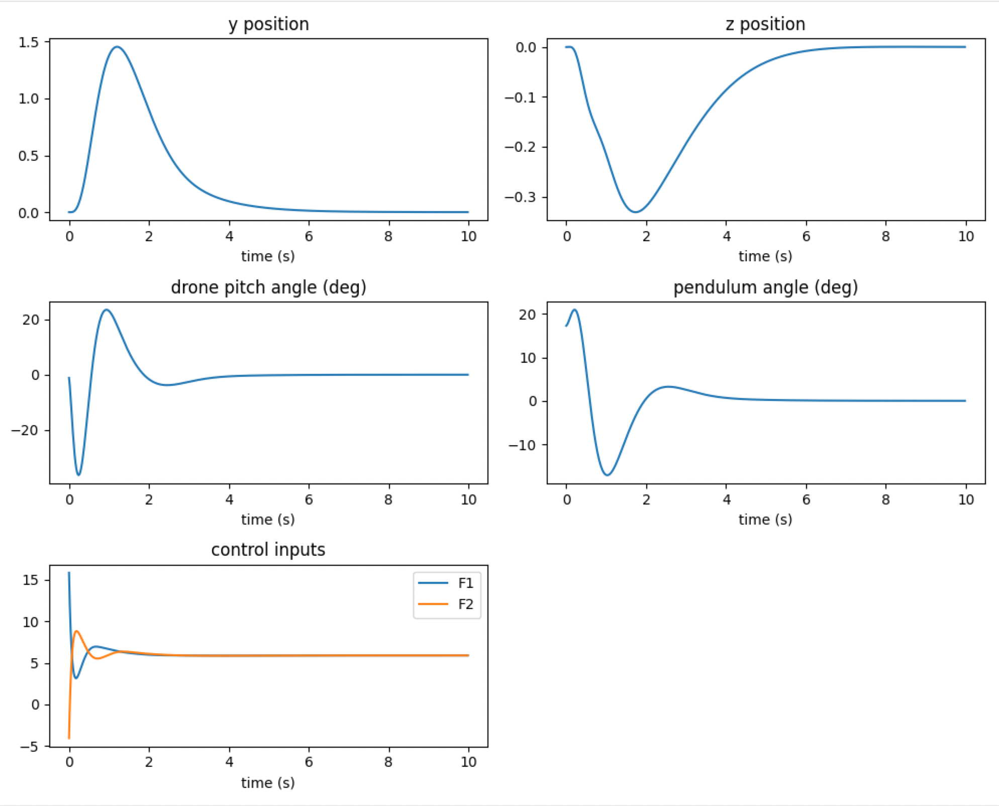

# 2D Inverted Pendulum on a Drone — Upright Stabilisation

Ticket: [#45](https://github.com/rp-itmo/simulator/issues/45)

## Overview

This module implements a planar (2D) quadrotor-pendulum system, stabilised at the upright equilibrium using LQR control. The drone is constrained to move in the vertical plane (Oyz), carrying a pendulum attached at its center of mass. The control objective is to keep the drone hovering while driving the pendulum angle to zero.

## System Model

The state vector is 8-dimensional:

```
x = [y, z, phi, theta, vy, vz, vphi, vtheta]
```

where `y, z` are the drone's horizontal and vertical position, `phi` is the drone pitch angle, and `theta` is the pendulum angle measured from the vertical. The control input is a pair of thrust forces `u = [F1, F2]`, generated by two motors located on each side of the drone body.

The equations of motion are derived from Newton-Euler dynamics and solved via numerical linear algebra at each timestep. Time integration is performed using a fourth-order Runge-Kutta (RK4) scheme.

## Control Design

The system is linearised about the hover equilibrium (`theta = 0`, `phi = 0`, `F1 = F2 = (M+m)g/2`) using central finite differences. The resulting linear state-space model `(A, B)` is used to solve the continuous-time algebraic Riccati equation, yielding the optimal feedback gain matrix `K`:

```
K = R^-1 B^T P
```

where `P` solves `A^T P + PA - PBR^-1B^T P + Q = 0`. The control law applied at runtime is:

```
u = u_eq - K(x - x_eq)
```

Closed-loop stability was verified by confirming that all eigenvalues of `A - BK` have negative real parts.

## Communication Architecture

The simulator and controller run as two independent processes, communicating over ZeroMQ using a publish-subscribe pattern. The simulator publishes the current state vector; the controller subscribes, computes the control input, and publishes it back for the simulator to consume.

## Repository Structure

```
examples/quadrotor_drone/
├── sim/
│   ├── dynamics.py        # Equations of motion, RK4 integrator
│   └── scene.py            # 2D rendering of drone and pendulum
├── control/
│   └── lqr_controller.py   # Linearisation and LQR gain computation
├── communication.py        # ZeroMQ publisher/subscriber wrappers
├── main.py                  # Simulation entry point
└── results/
    ├── figure.png            # State and control trajectories
    └── demonstrate.mp4       # Recorded stabilisation demo
```

## Results

The system was tested with an initial pendulum deviation of approximately 17 degrees (0.3 rad) from upright.



The pendulum angle converges to zero within approximately 4 seconds, following a single overshoot transient. The drone returns to its original hover position after the transient settles, and the control inputs converge to the steady-state hover thrust.

**Simulation demo (in-repo):** [examples/quadrotor_drone/results/demonstrate.mp4](examples/quadrotor_drone/results/demonstrate.mp4)

**Defense presentation video:** [Google Drive Link](https://drive.google.com/file/d/1W1nPJ9DKxFgFF4hnCv4SaLMkGTNO-J_c/view?usp=sharing)

## Running the Simulation

```bash
pip install numpy matplotlib scipy pyzmq pytest
python -m examples.quadrotor_drone.main
```

## Running Tests

```bash
nox
```

Tests cover the dynamics function output, RK4 integration step, LQR gain matrix dimensions, and closed-loop stability.

## Team

| Name | ISU | Role | Contribution |
|---|---|---|---|
| Xiang Zhang | 508513 | Team Lead | System dynamics modelling, scene rendering, project integration, pull request management |
| Chunhong Yuan | 521031 | Developer | LQR controller design and numerical linearisation |
| Zulmi Judha Fakral | 503252 | Tester | ZeroMQ communication layer, unit tests, CI pipeline verification |

## References

- Ticket specification: [rp-itmo/simulator#45](https://github.com/rp-itmo/simulator/issues/45)
- Reference implementation pattern: [pets-tech/mysegway_mujoco](https://github.com/pets-tech/mysegway_mujoco)
